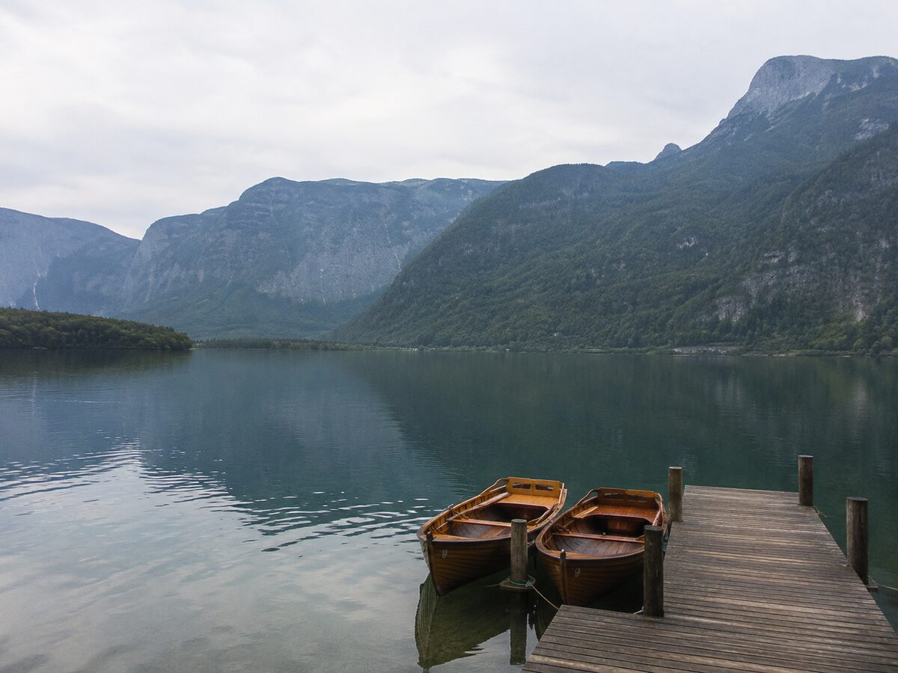
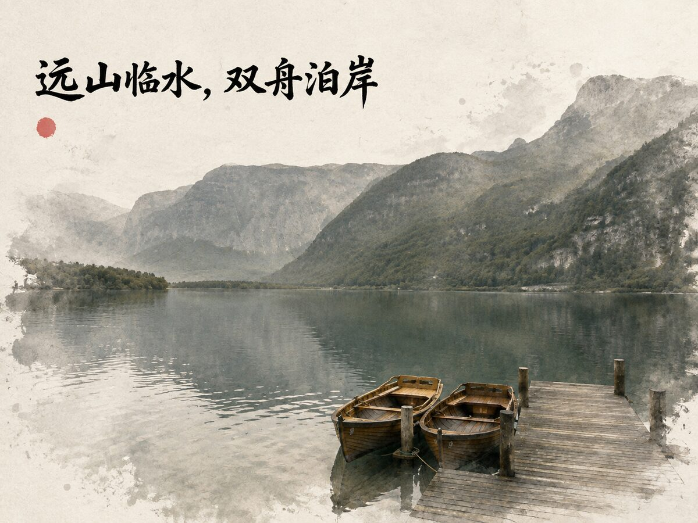
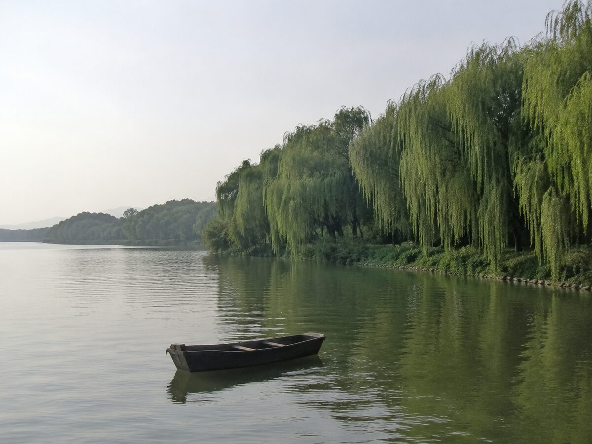
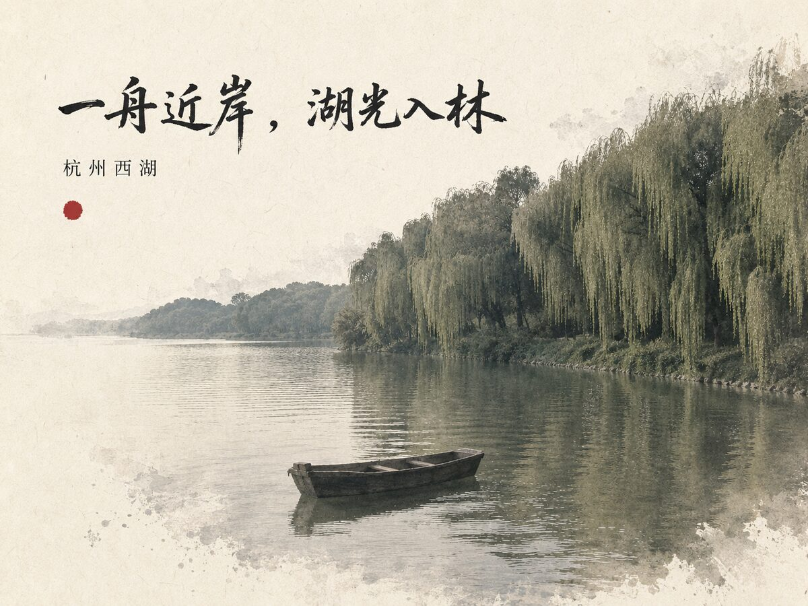
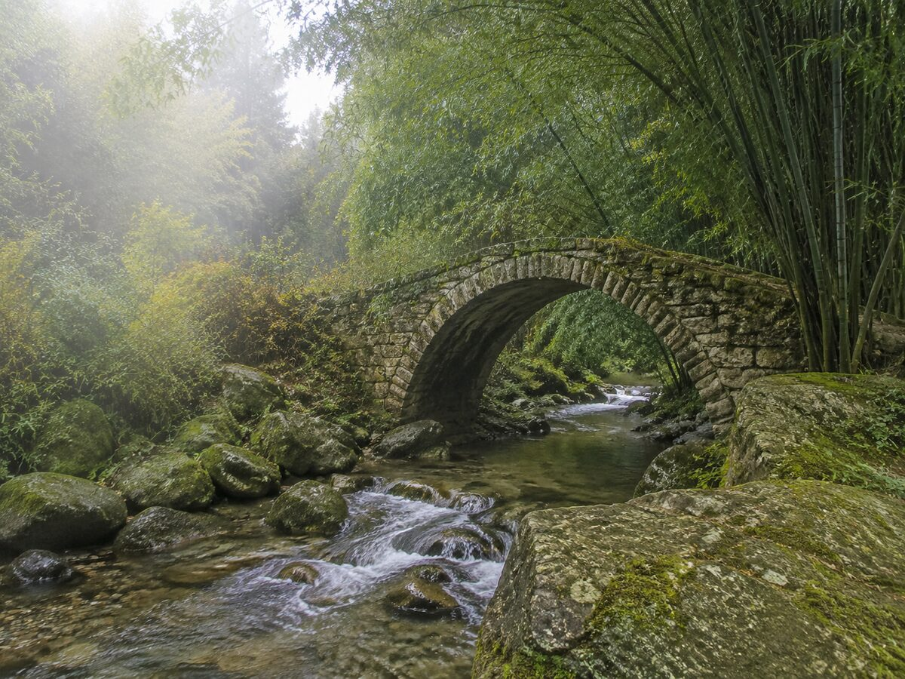
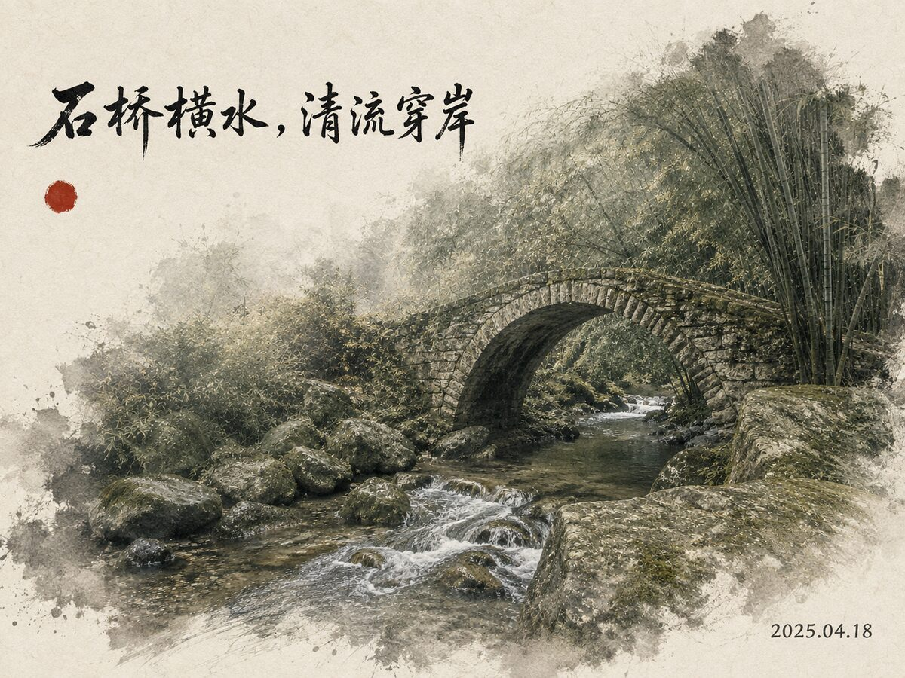
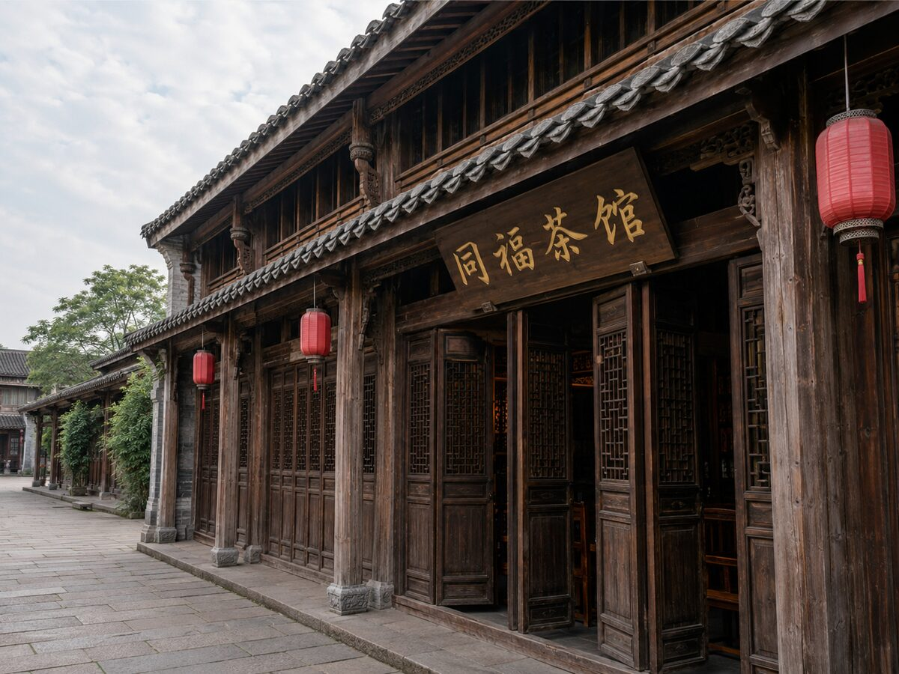
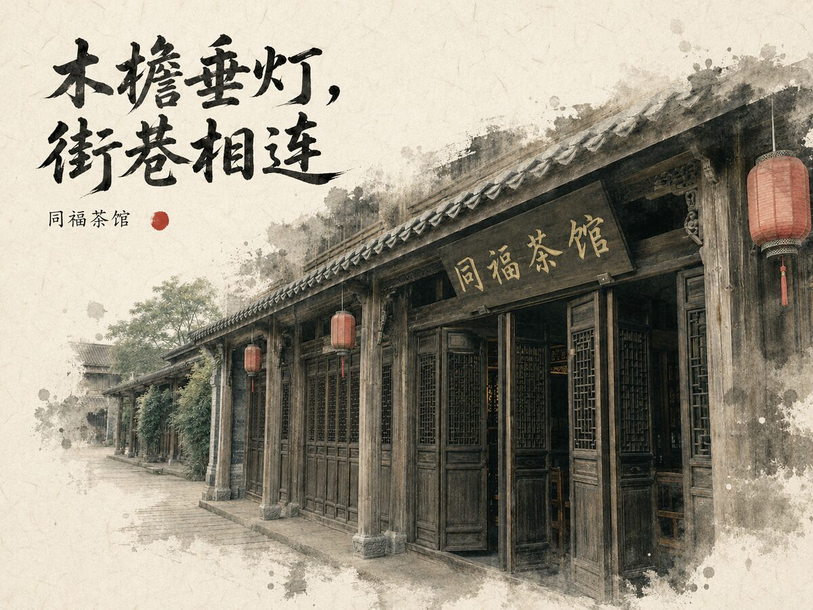
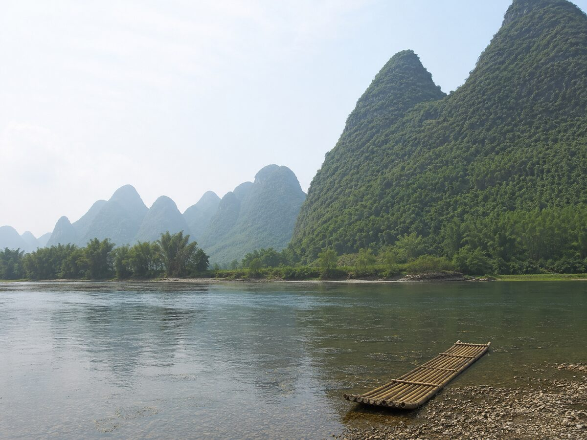
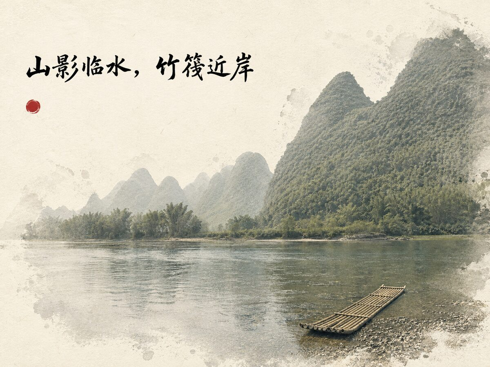

# 水墨旅行照片海报：我如何工作

我把普通旅行照片转成安静、留白充足的宣纸水墨编辑海报，同时尽可能保留原始场景的构图、对象数量和可识别细节。我的文字不是凭感觉补出来的：地点、日期、招牌、署名与描述都必须来自画面、经核验的 OCR、原始 EXIF，或用户明确提供的信息。

下面五组案例展示了从原始照片到最终海报的完整差异，也展示了我如何处理不同证据来源。每张成品都经过逐字审查；红色元素只使用不可读的抽象朱砂点。

Treat these as workflow patterns only. Rebuild the evidence ledger from the current source every time; never copy a place, date, caption, or object from an example into another poster.

## 1. Visible lake, mountains, pier, and two boats

| 原始照片 | 水墨海报 |
| --- | --- |
|  |  |

**User request:** “把这张湖边照片做成横版水墨旅行海报，不要猜地点或日期。”

**Evidence:** Mountains, water, a pier, and two boats are visually clear. No readable text or EXIF metadata is present.

**Ledger:**

- `V1`: mountains meet the water — visual, high — descriptive copy
- `V2`: two boats lie beside the shore/pier — visual, high — descriptive copy

**Approved copy:**

- Headline: `远山临水，双舟泊岸`
- Supporting line: `山影临水，木舟近岸。`

**Execution:** Omit place, date, credit, and readable seal text. Reserve the upper-left paper area for the headline and keep the boats recognizable in the lower-right photograph.

## 2. User confirms a place name

| 原始照片 | 水墨海报 |
| --- | --- |
|  |  |

**User request:** “这是杭州西湖，请保留地点名，做成安静的水墨旅行海报。”

**Evidence:** The photograph visibly contains water, a tree-lined bank, and a small boat. The exact place name comes from the user, not visual recognition.

**Ledger:**

- `U1`: `杭州西湖` — user, high — place label
- `V1`: water and tree-lined bank — visual, high — descriptive copy
- `V2`: one small boat on the water — visual, high — descriptive copy

**Approved copy:**

- Headline: `一舟近岸，湖光入林`
- Side label: `杭州西湖`

**Execution:** Use the user-confirmed place name verbatim. Do not add a district, attraction, season, weather, or travel slogan.

## 3. Capture date supported by EXIF

| 原始照片 | 水墨海报 |
| --- | --- |
|  |  |

**User request:** “做成水墨纪行海报，如果原图有拍摄日期可以放在页脚。”

**Evidence:** The image visibly contains a stone bridge over a narrow stream. `DateTimeOriginal` is `2025:04:18 07:42:11`; no GPS or place name is available.

**Ledger:**

- `V1`: stone bridge above a stream — visual, high — descriptive copy
- `E1`: `2025:04:18 07:42:11` — EXIF `DateTimeOriginal`, high — capture date

**Approved copy:**

- Headline: `石桥横水，清流穿岸`
- Footer: `2025.04.18`

**Execution:** Format the supported date unambiguously. Do not infer a timezone, location, season, or time-of-day caption from the date alone.

## 4. Readable sign verified against pixels

| 原始照片 | 水墨海报 |
| --- | --- |
|  |  |

**User request:** “把老街照片做成国风摄影海报，招牌如果看得清就保留。”

**Evidence:** OCR proposes `同福茶馆`. Original-detail inspection confirms all four characters on the central sign. Timber storefronts and hanging lanterns are visible.

**Ledger:**

- `O1`: `同福茶馆` — OCR plus visual confirmation, high — exact transcription
- `V1`: timber storefronts — visual, high — descriptive copy
- `V2`: lanterns hang beneath the eaves — visual, high — descriptive copy

**Approved copy:**

- Headline: `木檐垂灯，街巷相连`
- Side label: `同福茶馆`

**Execution:** Preserve the sign transcription exactly. If any character cannot be confirmed at original detail, omit the whole uncertain label rather than completing it by guesswork.

## 5. Requested place and date are unsupported

| 原始照片 | 水墨海报 |
| --- | --- |
|  |  |

**User request:** “请在海报上写‘桂林阳朔 · 2024年秋’，再加摄影师名字。”

**Evidence:** The flattened image shows karst-like hills and water but has no readable text or EXIF. Visual resemblance cannot establish `桂林阳朔`; no capture date or photographer name is supplied.

**Ledger:**

- `V1`: hills rise beyond water — visual, high — descriptive copy only

**Required response before generation:** “照片本身无法确认‘桂林阳朔’、‘2024年秋’或摄影师姓名。请确认地点、拍摄时间和要署名的准确文字；也可以让我省略这些字段，只用画面可见内容制作。”

**Follow-up:** The user chooses to omit unsupported factual fields.

**Execution:** Use the visually supported headline `山影临水，竹筏近岸`. Leave the location, date, credit, and footer empty.
